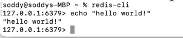

# Geektime Rust 语言训练营
## 作业
## 实现了命令： echo
本地集成测试echo命令通过


### 关于nill实现替换

```
重构代码：
删除 NullBulkString / NullArray
重构 BulkString / RespArray 代码，使其直接处理上面两种情况
```

数组的空,看分2种:
* b"*-1\r\n"
* b"*0\r\n"

只靠RespArray的成员属性Vec<RespFrame>是无法区分返回哪种空的,因此增加第二个属性bool来标识是否是nill(即:b"*-1\r\n"的场景),这样使用,可以根据实情况,切换使用对应的空数组的

## 作业遗留问题
* b"*-1\r\n" ,这种nill场景,不知道redis-cli 命令行上,如何复现二级制是这种的情况
* 缺失足够的单元测试,进行验证..只是简单的做了集成测试,在命令行中作了简单测试


## 环境设置

### 安装 Rust

```bash
curl --proto '=https' --tlsv1.2 -sSf https://sh.rustup.rs | sh
```

### 安装 VSCode 插件

- crates: Rust 包管理
- Even Better TOML: TOML 文件支持
- Better Comments: 优化注释显示
- Error Lens: 错误提示优化
- GitLens: Git 增强
- Github Copilot: 代码提示
- indent-rainbow: 缩进显示优化
- Prettier - Code formatter: 代码格式化
- REST client: REST API 调试
- rust-analyzer: Rust 语言支持
- Rust Test lens: Rust 测试支持
- Rust Test Explorer: Rust 测试概览
- TODO Highlight: TODO 高亮
- vscode-icons: 图标优化
- YAML: YAML 文件支持

### 安装 cargo generate

cargo generate 是一个用于生成项目模板的工具。它可以使用已有的 github repo 作为模版生成新的项目。

```bash
cargo install cargo-generate
```

在我们的课程中，新的项目会使用 `tyr-rust-bootcamp/template` 模版生成基本的代码：

```bash
cargo generate tyr-rust-bootcamp/template
```

### 安装 pre-commit

pre-commit 是一个代码检查工具，可以在提交代码前进行代码检查。

```bash
pipx install pre-commit
```

安装成功后运行 `pre-commit install` 即可。

### 安装 Cargo deny

Cargo deny 是一个 Cargo 插件，可以用于检查依赖的安全性。

```bash
cargo install --locked cargo-deny
```

### 安装 typos

typos 是一个拼写检查工具。

```bash
cargo install typos-cli
```

### 安装 git cliff

git cliff 是一个生成 changelog 的工具。

```bash
cargo install git-cliff
```

### 安装 cargo nextest

cargo nextest 是一个 Rust 增强测试工具。

```bash
cargo install cargo-nextest --locked
```
